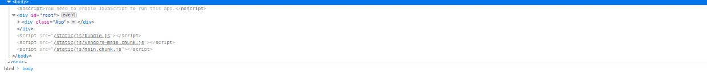

# Creating A React App
```
npx create-react-app my-app
cd my-app
npm start
```
# Install React Developer Tools (if you don't have it already)
https://addons.mozilla.org/en-US/firefox/addon/react-devtools/


# File System
- If we peer into our public directory, we can see an index.html (delete comments for simplicity).
- **This index.html has a div at the end of the body** like <br>
`<div id="root"></div>`
- This is the gateway to our React UI application. **In our source folder, we can look at index.js (entry point for REACT), notice** the 
`document.getElementById('root');` in the ReactDOM.render().
- **App.js contains the root app component. Every component we create is going to be in the main root App component. This is what gets placed in our div in the index.html file.**
## Our App.js will be the main component by which other components are contained. This App component gets placed into the div that we see in our index.html file. The index.html IS the gateway to our React UI application.
## App.js looks like HTML, but it is actually JSX (Javascript Syntax Extension).
- Notice `<div className="App"></div>` instead of `<div class='app'></app>`

## **Don't forget to delete App.css, App.test.js, logo.svg, setupTests.js and Others**

# JSX Expressions must have a single parent Element
## Note, this expression does not necessarily have to be a div. It can be a parent for all we care, but there can only be one parent.
```
    <div className="App">
      <h1>Hello From React</h1>
    </div>
    <h2>Hi</h2>
```
## Doesn't Work
```
    <div className="App">
      <h1>Hello From React</h1>
      <h2>Hi</h2>
    </div>
```
## Does Work

# Notice how App is a child element of root in this photo.


# Since this is JSX, we can write vanilla JavaScript!!
```
function App() {
  const name = 'Chukwudi';
  const x = false;
  return (
    <div className="container">
      <h1>Hello From React</h1>
      <h2>Hi {x ? name : 'Who?'}</h2>
    </div>
    
  );
}
```

# Recall, our user interface is a bunch of components.
## Convention: Name component files with an uppercase. ie.) Header.js

# App.js
```
import Header from './components/Header'
function App() {
  return (
    <div className="container">
      <Header />
    </div>
    
  );
}

export default App;
```

# Header.js
```
import React from 'react';

const Header = () => {
    return (
        <header>
            <h1>Tasker</h1>
        </header>
    )
} 
export default Header;
```

# Class Components
```
import {React, Component} from 'react'
import Header from './components/Header'


class App extends Component{
  render() {
    return (
      <h1>Hello From a Class</h1>
    )
  }
}
```

# Component Props
```
function App() {
  return (
    <div className="container">
      <Header title='Hello'/>
    </div>
    
  );
}
```
## Notice how I can set the title attribute equal to 'Hello'. Well.. is this an attribute in JSX? <br>
## If I go into Header.js I can access this property by setting my parameter equal to props and doing 'props.title'.
```
const Header = (props) => {
    return (
        <header>
            <h1>{props.title}</h1>
        </header>
    )
} 
export default Header;
```

# Default Props
## Suppose I created the title attribute on Header, but I decided not to reference it.
## I can set a defaultProp value in the Header.js file via.
```
App.js
function App() {
  return (
    <div className="container">
      <Header />
    </div>
    
  );
}
Header.js
Header.defaultProps = {
  title: 'Tasker'
}
```
## **Destructuring**
## Notice that props is just an object. We clean up our Header.js file by including only the values we want from the props object.
```
const Header = ({ title }) => {
    return (
        <header>
            <h1>{title}</h1>
        </header>
    )
} 
Header.defaultProps = {
    title: 'Tasker'
}
```

# Property Types
## When passing in numbers and strings to a component, wrap them in curly braces.
## App.js
```
  return (
    <div className="container">
      <Header title={1}/>
    </div>
    
  );
```

## Header.js
```
import React from 'react';
import PropTypes from 'prop-types';
.
.
.
Header.propTypes = {
    title: PropTypes.string, 
    // if required we can do PropTypes.string.isRequired
}
```
